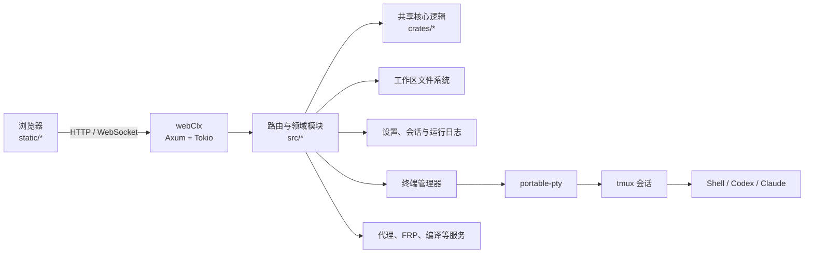

# webClx

中文 | [English](README.en.md)

[下载 v1.8.11](https://github.com/beyondcy1013/webClx/releases/tag/v1.8.11) ·
[申请 7 天独立托管试用](https://github.com/beyondcy1013/webClx/issues/new?template=hosted-trial.yml) ·
[商业支持与授权](COMMERCIAL.md) ·
[讨论区](https://github.com/beyondcy1013/webClx/discussions)

webClx 是面向 Codex、Claude、DeepSeek Harness 与普通 Shell 的自托管工作控制面。它保留各执行器的原生终端和上下文，同时统一提供工作区、会话、预设、任务转交、编译部署与移动端访问。

> 当前版本是开发者预览，适合可信网络中的个人工作站和私有服务器。它拥有文件修改、终端执行和部署能力，不应直接裸露到公网。

## 为什么使用 webClx

- **手机也能继续真实开发工作**：浏览器连接自己的开发机，继续使用原生 Codex、Claude、DeepSeek Harness 和 Shell，而不是把任务限制在简化聊天框里。
- **长任务不会随浏览器关闭而消失**：终端与 Agent 会话在后台持续运行，换电脑或手机后继续查看和接管。
- **不同 Harness 可以交接和复核**：内置终端消息 Skill 可把原任务、上下文和 review 请求在 Codex、Claude、DeepSeek 之间可靠转交。
- **代码和凭据留在自己的机器**：自托管模式下，工作区、终端和模型配置由使用者控制。

适合需要离开电脑后继续处理编译、部署、日志排查和 Agent 长任务的独立开发者与小团队。手机端优势来自远程访问完整开发环境，而不是在手机上复制一套缩水 IDE。

## 5 分钟开始

要求：Linux、Rust stable、`tmux`、Node.js。先在可信网络的测试机运行：

```bash
git clone https://github.com/beyondcy1013/webClx.git
cd webClx
cargo run --release -- serve
```

首次启动会在运行目录生成权限为 `0600` 的 `.webclx-initial-password`。从主机终端读取一次，用浏览器打开 `http://127.0.0.1:11111` 登录；首次成功登录后该恢复文件会自动删除。

准备远程使用前，请先阅读 [安全策略](SECURITY.md)，并配置 TLS、主机防火墙或 VPN。不要把 `11111` 管理端口直接暴露到公网。

不想自行部署时，可[申请 7 天独立托管试用](https://github.com/beyondcy1013/webClx/issues/new?template=hosted-trial.yml)。试用实例按客户隔离，不与项目维护者或其他客户共享管理员账号、Cookie、工作区或模型凭据。

一个用 Rust 写的轻量 Web 工作区：

- 浏览当前工作目录里的文件和文件夹
- 在线查看、修改 UTF-8 文本文件
- 对文件夹提供 `coding here` 链接，进入网页终端
- 同一个目录可以保留多个终端会话，并在网页里切换、改名
- 首页新增“会话” TAB，可直接查看跨目录的全部会话并快速切换到指定会话
- 终端会话在浏览器关闭后继续保留
- 默认工作目录独立于服务进程的 `WorkingDirectory`，可在网页设置页里指定为任意存在且可访问的绝对目录
- 默认工作目录支持再向上进入一层父目录，但不能继续向上跨更多层
- 可在设置页控制是否显示 `.` 开头的文件和目录，默认显示
- 中文与英文界面可在浏览器中即时切换，语言偏好只保存在当前浏览器
- 随程序内置 `webclx-terminal-message` Skill，支持 Codex、Claude 与 DeepSeek Harness 之间转交、回复和相互 review

## 多智能体任务转交

webClx 通过可确认投递的终端消息 API 保留 Agent 的完整交互上下文。建议同一工作树只有一个写入者，其它 Agent 只读 review：

```bash
python3 ~/.codex/skills/webclx-terminal-message/scripts/send_terminal_message.py \
  --target 'project-review' \
  --from 'project-implement' \
  --message '请只读 review 当前 diff，并返回具体问题。' \
  --request-reply
```

内置 Skill 同时安装到终端用户的 Codex、Claude 与 DeepSeek Harness Skill 目录（默认分别为 `~/.codex/skills`、`~/.claude/skills`、`~/.dsh/skills`）。三种 Harness 使用同一套可验证终端消息协议；DeepSeek 尚未提供兼容 Codex/Claude rollout 的提交回执时，可按 Skill 说明使用 `--no-verify`。

## 架构概览

webClx 以单个 Rust 二进制提供 Web 页面、HTTP API 和终端 WebSocket。后端按领域拆分在 `src/`，可复用且较少依赖运行时状态的逻辑放在 workspace 的 `crates/` 中。



- `src/main.rs` 初始化共享状态、组装公开/受保护路由，并优先从运行目录提供静态资源；资源不存在时使用编译进二进制的 `static/`。
- `src/filesystem.rs`、`src/terminal.rs`、`src/settings.rs` 等模块负责对应 API 和运行时编排。
- `crates/*_core` 保存认证、设置、终端、运行路径和 API 目录等可复用核心逻辑。
- `static/` 是不依赖前端构建工具的浏览器端源码，`tests/*.test.mjs` 覆盖主要前端行为。

## 运行

```bash
cargo run -- serve
```

默认监听所有网络接口：

```text
0.0.0.0:11111
```

本机访问地址通常是 `http://127.0.0.1:11111`。如需对外提供服务，应同时配置主机防火墙和反向代理认证。

默认浏览根目录：

```text
优先使用内置默认工作区 `/home/codes`，不可用时回退到 `/home`
```

可以通过环境变量修改端口；主机部分会被规范为 `0.0.0.0`：

```bash
WEBCLX_ADDR=0.0.0.0:4000 cargo run -- serve
```

## 命令行预设切换

部署脚本会创建 `/usr/local/bin/webclx` 命令入口。CLI 通过本机 webClx API
读取和应用预设，不直接修改 Codex 或 Claude 配置文件：

```bash
webclx list
webclx list api
webclx current
webclx use api "primary"
webclx use api "gpt-5.6-sol"
webclx use oauth "plus-account"
webclx use claude "anthropic"
```

`use` 是显式永久切换，会写入共享配置。`run` 则为本次 agent 创建一次性隔离配置，
不会修改活动预设、用户 `config.toml` 或其它会话；agent 退出后自动清理：

```bash
webclx run api "primary" -- codex
webclx run api "gpt-5.6-sol" -- codex
webclx run api "primary" -- codex resume <session-id>
webclx run oauth "plus-account" -- codex
webclx run claude "anthropic" -- claude --continue
```

预设参数支持精确名称或 ID；API 类型还支持精确模型名，
并选择该模型在保存顺序中的第一条预设。解析优先级为 `ID → 唯一名称 → 模型首条`，
名称重复时必须使用 ID。Codex_API 表格可切换到“大模型”分组，并用组内排序维护模型首条。
执行 `webclx help` 或 `webclx help run` 可以查看完整用法。服务不在默认的
`http://127.0.0.1:11111` 时，可通过 `WEBCLX_URL` 指定本机地址。

## systemd 服务

已经可以安装为：

```text
webclx.service
```

常用管理命令：

```bash
systemctl status webclx
systemctl restart webclx
systemctl stop webclx
journalctl -u webclx -f
```

修改代码后，通过 webClx 部署队列构建、安装并重启服务：

```bash
bash /home/root/.codex/skills/webclx-compile-api/scripts/request-webclx-deploy-api.sh \
  --project webClx \
  --project-dir /home/codes/webClx \
  --command 'cargo build --release' \
  --install-command 'bash scripts/rebuild-and-deploy.sh --skip-build' \
  --audit-path /home/bin/webclx/webClx \
  --audit-path /home/bin/webclx/static \
  --audit-path /usr/local/bin/webclx \
  --note '部署本次 webClx 改动'
```

队列返回 `queued: true` 后等待源终端回调，不要继续轮询或手工重启服务。直接部署 API、手工兜底步骤和路径说明见 [webClx rebuild skill](docs/codex/skills/webclx-rebuild/SKILL.md)。

如需在 webClx 里托管 FRP，在网页“设置 → FRP”中以表格管理 `frpc` / `frps` 角色。每个角色可直接下载当前平台匹配的官方二进制，也可以使用运行目录中的自带二进制、服务进程 `PATH` 里的系统二进制，或填写绝对路径。页面还能检测系统 `PATH` 和正在运行的 `frpc` / `frps -c <配置文件>` 进程；检测到配置文件的外部进程可以接管为角色，后续启动会继续使用原配置文件。

```bash
install -m 0755 frpc /home/bin/webclx/frpc
install -m 0755 frps /home/bin/webclx/frps
```

多角色配置保存在 `/home/bin/webclx/.webclx-frp/roles.json`，各角色会在 `.webclx-frp/<role-id>/` 下生成 TOML 和日志。旧单实例兼容配置仍位于 `.webclx-frpc/` 和 `.webclx-frps/`。

网页设置会持久化到：

```text
/home/bin/webclx/webclx-settings.json
```

注意：

- 当前 `webclx.service` 的 `WorkingDirectory` 是 `/home/bin/webclx`
- 当前仓库规范路径是 `/home/codes/webClx`
- 服务启动后会从 `current_dir()/static` 读取静态资源，所以实际生效的是 `/home/bin/webclx/static/*`
- 设置页“系统”TAB 可以选择新终端用户身份；默认是 `root`
- 设置页“系统”TAB 可以配置终端快捷命令；默认 `1` 启动 `codex`，`2` 启动 `claude`，3 秒未选择时默认启动 `1`
- Codex / Claude 配置路径按设置页选择的用户身份解析；在 Unix 上通过系统用户库获取该用户的 home 和 shell
- 当前这台机器 `root` 的真实 home 当前是 `/home/root`；这是运行时状态，不要把它写死到代码、脚本或 service 里
- 不要通过 `/etc/default/webclx` 或其他环境变量去改写 `.codex` / `.claude` 的目标路径；旧路径如 `/root/.codex`、`/home/beyondcy/.codex` 只应作为兼容符号链接存在
- Cargo 的真实构建产物目录可能来自 `~/.cargo/config.toml` 的 `target-dir`；部署时先确认 `target_directory`
- 只改仓库里的 `static/*` 而不把文件同步到 `/home/bin/webclx/static/*`，前端页面不会更新
- 如果默认工作目录配置的是符号链接路径，页面和设置文件会保留该显示路径；日志里会同时给出 canonical 真实路径
- 文件浏览和网页终端默认进入哪个目录，由网页“设置”页里的默认工作目录决定
- 进入默认目录后，网页里可以通过 `..` 进入它的上一层，但不能继续 `../..` 往上跨更多层

## 开发文档

- [文档导航](docs/README.md)
- [Codex 主题索引](docs/codex/index.md)
- [试用与商业化执行手册](docs/trial-commercial-playbook.md)
- [中英文发布文案与渠道顺序](docs/launch-copy.md)
- [项目开发规则](AGENTS.md)

## 开发与贡献

### 环境准备

- 支持 Rust 2024 edition 的稳定 Rust 工具链
- `tmux`，用于创建和恢复 Unix 终端会话
- Node.js，用于运行 `tests/*.test.mjs` 前端测试
- `systemd` 仅用于服务安装和终端 scope 隔离；本地开发运行不强制要求
- `frpc` / `frps` 仅在开发对应 FRP 功能时需要，也可以由设置页下载

```bash
git clone https://github.com/beyondcy1013/webClx.git
cd webClx
cargo run
```

也可从 [GitHub Releases](https://github.com/beyondcy1013/webClx/releases) 下载带 SHA-256 校验文件的版本化源码包。包内的 `SOURCE_RELEASE` 与 `STATIC_ASSETS_MANIFEST.sha256` 记录后端提交和静态资源来源。

服务启动后访问 `http://127.0.0.1:11111`。开发时直接修改 `static/*`；磁盘静态资源优先于二进制内嵌副本，无需额外的前端构建步骤。

### 提交前检查

根据改动范围运行相关检查；完整基线为：

```bash
cargo fmt --check
cargo check --workspace
cargo test --workspace
node --test tests/*.test.mjs
```

开始修改前先阅读 [项目开发规则](AGENTS.md) 和 [Codex 主题索引](docs/codex/index.md)。保持改动聚焦，更新受影响的测试和文档，只提交本次任务涉及的文件或 hunk，并使用 Conventional Commits。

### 依赖维护

本项目是二进制 workspace，`Cargo.lock` 应随依赖变更一起提交。定期检查并更新锁文件，更新后执行完整测试：

```bash
cargo update --dry-run
cargo update
cargo test --workspace
```

`cargo-audit` 不是 Cargo 内置子命令；安装后可根据已提交的 `Cargo.lock` 检查已知漏洞：

```bash
cargo install cargo-audit --locked
cargo audit
```

## 终端会话说明

- `coding here` 打开的终端以目标文件夹作为工作目录
- 工作区路径只决定终端的起始 `cwd`；用户身份决定终端的 HOME/shell 以及 `.codex` / `.claude` 配置目录
- 已存在的终端会话保留创建时的用户身份；修改设置只影响后续新建会话
- 同一个目录可以同时存在多个后台 PTY 会话
- 新建会话时会按目录自动命名为 `目录名1`、`目录名2` 这类名字
- 一旦你在页面里手动改名，该会话名称就会锁定，不再被自动命名覆盖
- 终端页会显示当前目录下的会话列表，可以随时切换
- 终端软键盘上的快捷命令按钮来自设置页；每项由按钮键、显示名称、程序和参数组成
- 浏览器标签页关闭后，shell 和其中运行的 `codex` 进程不会被杀掉
- 如果通过 `systemd` 运行服务，新建的 tmux 会话会放到独立 scope，`systemctl restart webclx` 后仍然保留
- 如果 `systemd-run --scope` 因权限或 polkit 限制不可用，会自动回退到普通 tmux 创建；此时终端仍可用，但服务重启后会话是否保留取决于宿主进程管理方式
- 重新打开同一路径的 `coding here` 页面，会回到最近使用的会话；也可以在列表里切换到其他会话

## 限制

- 在线编辑目前只支持 UTF-8 文本文件
- 大文件默认不在网页里编辑，避免一次性把太多内容塞进浏览器
- 目录访问范围限制在“当前默认工作目录”以及它的上一层目录
- 非 `systemd` 场景下，tmux 会话是否跨宿主进程重启保留，取决于外部进程管理方式

## 安全、贡献与许可

- 部署前阅读 [安全策略](SECURITY.md)。首次启动会随机生成登录密码，并以仅文件所有者可读的权限写入运行目录 `.webclx-initial-password`；新安装默认用户为 `webclx`，从旧版升级时保留原用户名。请从主机终端读取恢复文件并妥善保存，首次成功登录后该文件会自动删除。对外访问必须通过 TLS 反向代理、防火墙或 VPN。
- 贡献要求见 [CONTRIBUTING.md](CONTRIBUTING.md)，第三方组件声明见 [THIRD_PARTY_NOTICES.md](THIRD_PARTY_NOTICES.md)。
- webClx 使用 [GNU AGPL-3.0-or-later](LICENSE)；无法遵守 AGPL 网络源码义务的组织可另行协商商业许可和支持服务。
